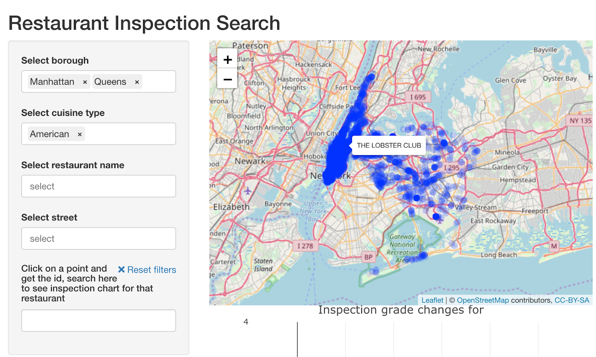
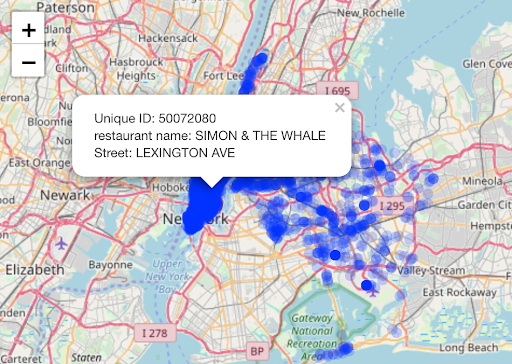
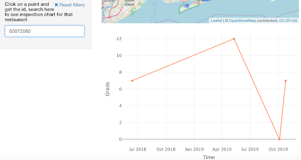
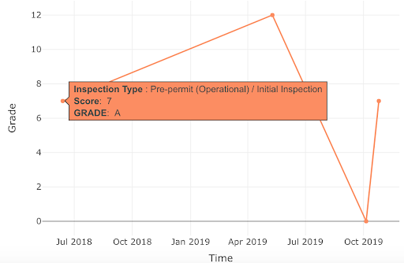

# Interactive component

In this interactive part, we created a map with points representing restaurant locations. We want to provide users with a tool to look at the
scores of restaurants that they might be interested at, as well as the score changings by time. We hope this interactive map can give users a general idea of qualities of the restaurants and how they change as time goes by.

Here is the link to the map:

https://jiaqi-tang.shinyapps.io/NYC_RESTAURANT_INSPECTION/

## Map

Users can search restaurants by using selection on the left. (Multiple selection in one section is allowable.)

The map will show the corresponding restaurants by the points. Every single point represents a restaurant:

-If you move your mouse on the map, once it’s on a point, the name of the corresponding restaurant will be shown.

-If you click on a point, some details about the corresponding restaurant will be shown, including id, name and street.

-You can also use the dropdown menu on the left for filtering and individual searchings.

-If you feel the point too vague to be identified, zoom in the map and the point will be more clear.

-If you want to know the corresponding description of the violation code, use the bottom bar for searching.

The darker the area is, the more concentrated the restaurants in that area.

## Line Chart

Type in the restaurant id in the left section, a line chart showing the score change of the restaurant appears below the map.

If you move your mouse on a point, the details about the score will be shown.

Notes on use of this interactive graph:

Make sure you don’t input extra whitespace when type in the id on the left section.
